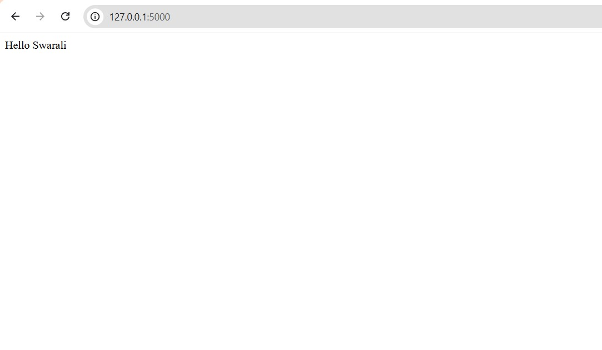
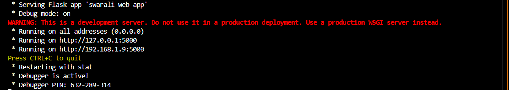

```md
# Swarali Web App

A simple Flask-based web application developed as part of cloud and DevOps learning.

## Overview
This project demonstrates:
- Basic web app development using Flask
- Containerization using Docker
- Version control using Git
- Deployment planning using AWS ECS

## Purpose
This project is part of my cloud and DevOps learning journey to understand real-world deployment using AWS ECS.

##  Technologies Used
- Python (Flask)
- Docker
- AWS ECS
- Git & GitHub

## Project Structure
- swarali_web_app.py
- Dockerfile
- README.md

##  Setup Instructions

### 1. Clone the repository
```
bash
git clone https://github.com/SwaraliSangolkar/swarali-web-app.git

### 2. Install dependencies
```bash
pip install flask
```

### 3. Run the application
```bash
python swarali-web-app.py

## Docker

```bash
docker build -t swarali-app .
docker run -p 5000:5000 swarali-app

## Future Improvements
- Add frontend UI
- Deploy on AWS ECS
- Add CI/CD pipeline

## Author
Swarali Sangolkar

## Screenshots

### App Output


### Terminal Output

